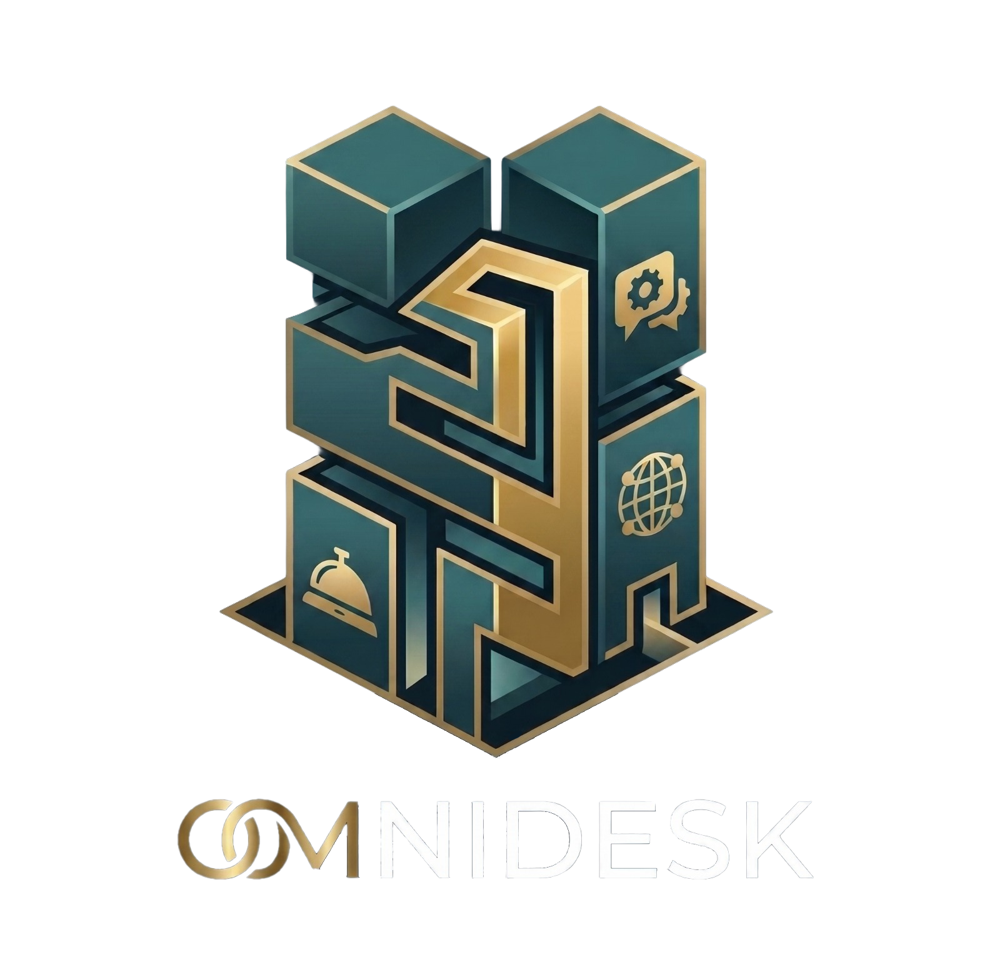

# 📚 Documentación - OmniDesk

Este directorio contiene la documentación funcional y técnica del proyecto

## Elevator's Pitch

* **Para** dueños de hoteles y alojamientos,
* **quienes** necesitan automatizar la atención al cliente y la gestión de reservas sin perder oportunidades de venta por demoras.
* **El** OmniDesk
* **es un** CRM conversacional impulsado por Inteligencia Artificial
* **que** automatiza respuestas vía Telegram, agenda turnos verificando pagos y centraliza el control con un dashboard de estadísticas.
* **Diferente a** los chatbots tradicionales rígidos o la gestión manual,
* **nuestro proyecto** entiende el contexto real del negocio y permite lanzar campañas de marketing masivas y proactivas para fidelizar clientes.

## Integrantes

* Lucrecia Colón
* Lautaro Lovato
